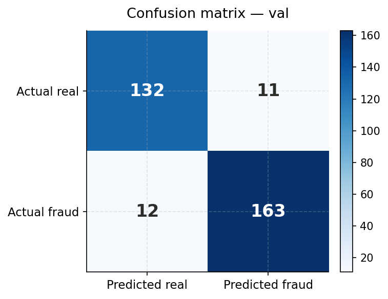
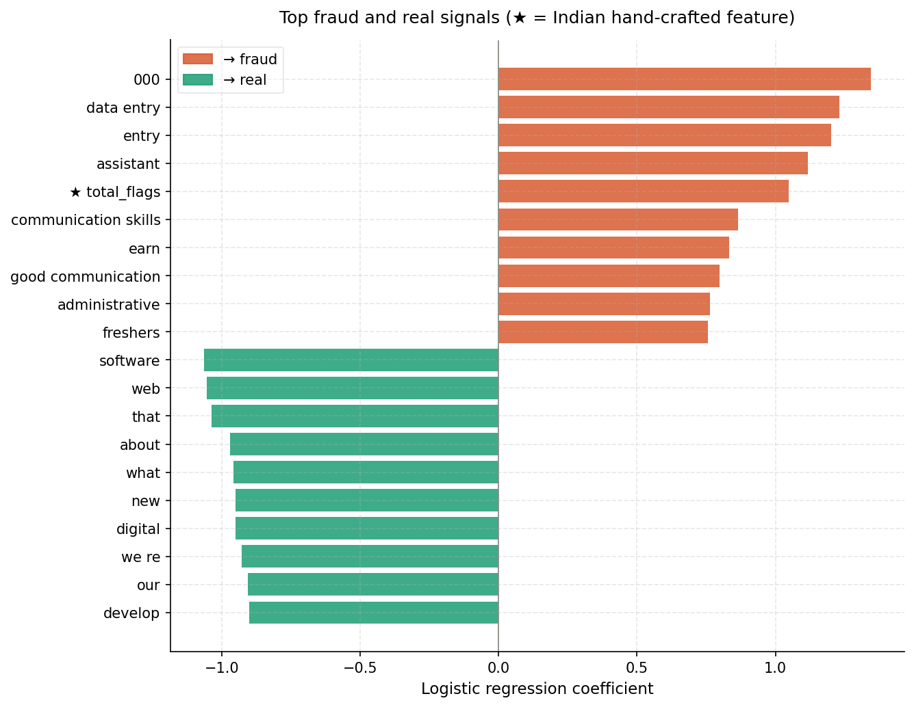
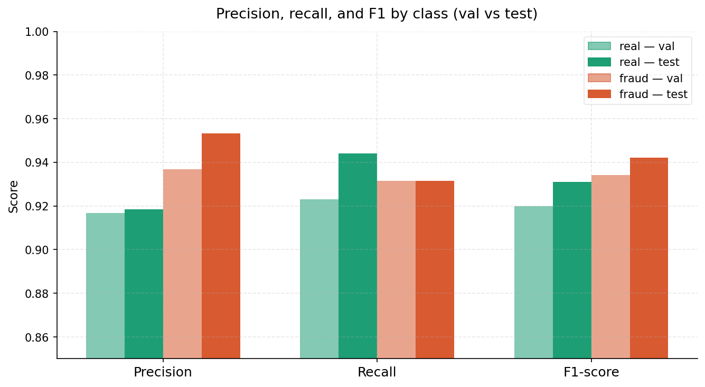
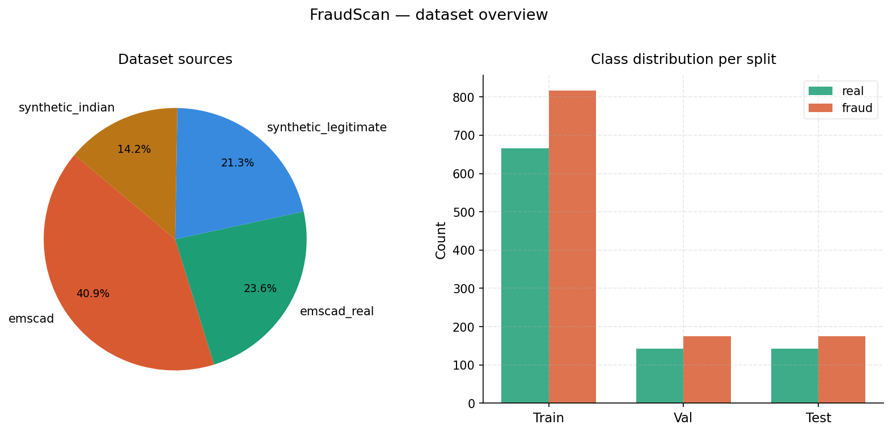

# Indian Job Fraud Detector

A machine learning system that detects fraudulent job postings in the Indian market - deployed as a live API, Chrome extension, and public web interface.

**Live demo:** https://aditsawhney.github.io/Fraud-Job-Detector

---

## Overview

Job fraud is a significant problem in India. Scams involving upfront registration fees, Aadhaar/PAN collection, WhatsApp-only contacts, and MNC impersonation are widespread. No publicly labeled dataset of Indian job fraud existed, so this project builds one from scratch and trains a model on it.

The system combines TF-IDF text analysis with 15 hand-engineered India-specific fraud signals, wrapped in a FastAPI backend and surfaced through a Chrome extension that runs inline on LinkedIn job pages.

---

## Model Performance

| Metric | Score |
|--------|-------|
| Test accuracy | 0.94 |
| Fraud F1 | 0.94 |
| Real F1 | 0.93 |
| False positives | 8 |
| False negatives | 12 |

Evaluated on a held-out test set of 318 rows.

**Caveat:** the real class is majority synthetic. These metrics likely overstate real-world performance - no evaluation on genuine LinkedIn postings has been done yet.

### Evaluation charts

| | |
|---|---|
|  |  |
|  |  |



---

## Dataset

Three-source hybrid — 2,118 rows total.

| Source | Rows | Label |
|--------|------|-------|
| Groq-generated synthetic Indian jobs | 452 | real |
| Groq-generated synthetic Indian jobs | 300 | fraud |
| EMSCAD benchmark dataset | 500 | real |
| EMSCAD benchmark dataset | 866 | fraud |

The 300 synthetic fraud rows cover 6 Indian-specific archetypes (50 each): fee-based scams, data harvesting, guaranteed placement, simple task scams, MNC impersonation, and overseas visa fraud. Generated using `data_pipeline/generate_dataset.py`, grounded in a documented taxonomy in `data_pipeline/indian_fraud_taxonomy.py`.

EMSCAD adds real human-written Western scam postings to diversify the fraud class beyond purely synthetic data.

> EMSCAD citation: "Employment Scam Aegean Dataset", University of the Aegean, 2014. [Kaggle](https://www.kaggle.com/datasets/shivamb/real-or-fake-fake-jobposting-prediction)

---

## Model

**Architecture:** `CombinedFeatureExtractor` — a single sklearn transformer that computes:
- TF-IDF (1–2 ngrams, 30k features, sublinear_tf)
- 15 hand-crafted Indian fraud regex features
- 2 meta-features: `total_flags`, `flag_density`

These are hstacked into one sparse matrix and fed into a `LogisticRegression` classifier (`class_weight='balanced'`, C=1.0).

Logistic regression was chosen deliberately: `coef_` gives direct feature-level explainability, inference is fast enough for Render's free tier, and the dataset (2,118 rows) is too small to justify deep models.

### 15 Indian fraud signals

`fee_language` · `upfront_payment` · `unrealistic_salary` · `guaranteed_job` · `whatsapp_only` · `gmail_contact` · `personal_phone` · `aadhaar_request` · `pan_request` · `bank_details_early` · `mnc_impersonation` · `background_check_fee` · `overseas_visa_fee` · `simple_task_scam` · `vague_company`

---

## Project structure

```
fraud-job-detector/
├── website/                       ← public-facing site (GitHub Pages)
│   ├── index.html
│   ├── css/
│   ├── screens/
│   ├── js/
│   └── images/
├── data/
│   ├── raw/
│   │   ├── synthetic_indian_jobs.csv
│   │   └── emscad_fake_job_postings.csv
│   └── processed/
│       ├── train.csv / val.csv / test.csv
│       └── dataset_metadata.json
├── data_pipeline/
│   ├── indian_fraud_taxonomy.py   ← 6 fraud archetypes, documented
│   ├── generate_dataset.py        ← synthetic data generation
│   └── merge_datasets.py          ← combines synthetic + EMSCAD
├── model/
│   ├── features.py                ← CombinedFeatureExtractor
│   ├── train.py
│   ├── model.pkl
│   ├── evaluation_report.json
│   └── top_features.json
├── backend/
│   ├── app.py                     ← FastAPI, POST /predict
│   └── requirements.txt
├── extension/
│   ├── manifest.json
│   ├── content.js
│   ├── background.js
│   ├── popup.html / popup.js / popup.css
│   └── sites/
│       └── linkedin.js            ← DOM scraper
└── reports/
    ├── confusion_matrix_test.png
    ├── confusion_matrix_val.png
    ├── feature_coefficients.png
    ├── precision_recall_f1.png
    └── dataset_composition.png
```

---

## Running locally

**Backend**

```bash
cd backend
pip install -r requirements.txt
uvicorn app:app --reload
```

The backend runs at `http://127.0.0.1:8000`. `model/features.py` must be present alongside `app.py` for the pickle to deserialise correctly.

**Website**

```bash
cd website
python3 -m http.server 8080
```

Open `http://localhost:8080`.

**Extension**

1. Go to `chrome://extensions`
2. Enable Developer Mode
3. Click "Load unpacked" → select the `extension/` folder
4. Navigate to a LinkedIn job posting on `linkedin.com/jobs/view/`

---

## API

`POST /predict` — https://fraud-job-detector-1mdz.onrender.com

Request:
```json
{
  "title": "Software Engineer",
  "company": "Acme Corp",
  "location": "Bangalore",
  "salary": "₹8-12 LPA",
  "contact": "",
  "description": "..."
}
```

Response:
```json
{
  "prediction": "fraud",
  "confidence": 0.91,
  "risk_level": "High",
  "reasons": ["aadhaar number requested upfront", "whatsapp-only contact"],
  "top_model_features": [
    {"feature": "indian_aadhaar_request", "coefficient": 1.04},
    {"feature": "indian_whatsapp_only", "coefficient": 0.74}
  ]
}
```

Full docs: https://fraud-job-detector-1mdz.onrender.com/docs

---

## Known limitations

- Metrics are measured on a partially synthetic dataset and likely overstate real-world performance.
- Short legitimate company names (EY, TCS) occasionally trip the `vague_company` feature.
- LinkedIn's search results layout (`/jobs/search-results/`) uses obfuscated class names and is not supported. The extension prompts users to open the full job view instead.
- Render free tier spins down after inactivity - first request after idle takes ~30 seconds. The extension and website fall back to local heuristics during this time.

---

## Author

Built by [Adit Sawhney](https://github.com/aditsawhney)
